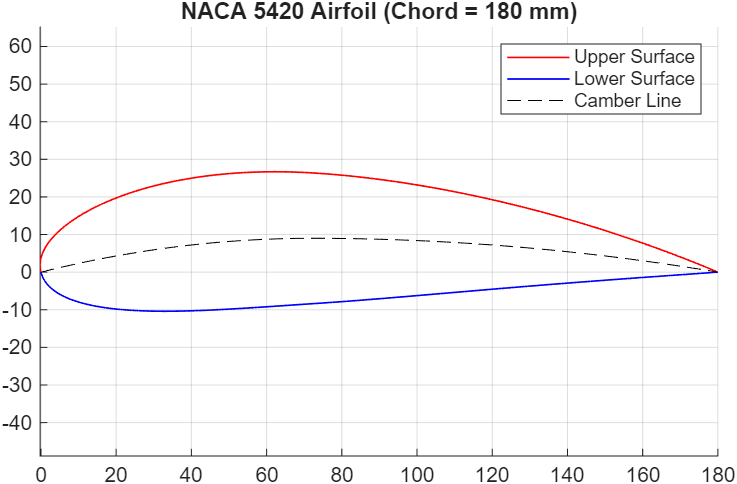

# NACA Airfoil Generator (MATLAB)  
MATLAB implementation of NACA 4-digit, 5-digit, and 6-digit airfoil equations.  
Generates surface coordinates, plots geometry, and exports results to Excel.  
Ideal for CFD preprocessing, structural modeling, or visualization.

---

## ✈️ Features
- Generate any NACA 4-digit, 5-digit, or 6-digit airfoil (e.g. `2412`, `23012`, `641212`)
- Cosine-spaced x-distribution (clusters points near LE/TE)
- Handles symmetric and cambered foils
- Select open or closed trailing edge
- Outputs:
  - Upper/lower surface arrays
  - Camber line
  - Closed-loop surface array (TE → LE → TE)
- Built-in plotting
- Export to `.xlsx` for external tools

---

## 📖 Theory

### NACA 4-Digit Series

- 1st digit: maximum camber, as % of chord (`m`)
- 2nd digit: location of maximum camber from the LE, in tenths of chord (`p`)
- Last two digits: maximum thickness, as % of chord (`t`)

#### Equations

**Thickness distribution**
```math
y_t = 5t \left( 0.2969 \sqrt{x} - 0.1260 x - 0.3516 x^2 + 0.2843 x^3 + a_4 x^4 \right)
```
where `a₄ = -0.1036` (closed TE), or `-0.1015` (open TE).

**2. Camber line**

```math
y_c =
\begin{cases}
\frac{m}{p^2}(2px - x^2), & x < p \\
\frac{m}{(1-p)^2}((1 - 2p) + 2px - x^2), & x ≥ p
\end{cases}
```

**3. Camber slope**

```math
\frac{dy_c}{dx} =
\begin{cases}
\frac{2m}{p^2}(p - x), & x < p \\
\frac{2m}{(1-p)^2}(p - x), & x ≥ p
\end{cases}
```

---

### NACA 5-Digit Series

- 1st digit: design lift coefficient, `C_L = 0.15 × L`
- 2nd digit: position of max camber, `p = P/20`
- 3rd digit: 0 = normal, 1 = reflexed
- Last two digits: thickness as % chord (`t`)

#### Camber Line Equation (approximate)
For normal camber (reflex = 0):
```math
\text{If } x < p:
\quad y_c = \frac{k_1}{6}(x^3 - 3p x^2 + p^2(3 - p)x)
\quad
\frac{dy_c}{dx} = \frac{k_1}{6}(3x^2 - 6p x + p^2(3-p))
```
For \( x \geq p \):
```math
y_c = \frac{k_1 p^3}{6}(1 - x)
\quad
\frac{dy_c}{dx} = -\frac{k_1 p^3}{6}
```
Where \( k_1 \) is a function of design \( C_L \) and \( p \) (see script).

For reflexed camber, a cubic subtraction is added near the trailing edge.

---

### NACA 6-Series

- 1st digit: series (6)
- 2nd digit: location of minimum pressure (in tenths of chord)
- 3rd digit: design lift coefficient (`a`)
- Next digits: additional camber or pressure recovery (not handled in classic script)
- Last two digits: thickness as % chord (`t`)

**In this script:**  
6-series airfoils are generated as symmetric (mean camber = 0) due to their complex pressure recovery definitions.  
Thickness uses the same NACA formula as above.

---

### Surface Coordinates

```math
\theta = \arctan\!\left(\frac{dy_c}{dx}\right)
```

```math
x_u = x - y_t \sin(\theta)
```
```math
y_u = y_c + y_t \cos(\theta)
```
```math
x_l = x + y_t \sin(\theta)
```
```math
y_l = y_c - y_t \cos(\theta)
```

---

## 🚀 Usage

```matlab
c = 180;  % Chord length in mm

% Generate a NACA 23012 (5-digit) airfoil with 201 points, closed trailing edge
[xu, yu, xl, yl, xc, yc] = airfoil_5digit('23012', linspace(0, c, 201), c, 'closed');
```

---

## 📊 Example Plot

---
### NACA 5420 (Chord = 180 mm)


---

## 📂 File Structure

```
NACA_Airfoil_Generator/
├── generate_naca4_airfoil.m
├── NACA56_Airfoil_Generator.m   % 5/6 digit generator
├── example.m
├── README.md
└── LICENSE
```

---

## 📚 References

* Anderson, J. D. *Fundamentals of Aerodynamics*
* Abbott, I. H., & von Doenhoff, A. E. *Theory of Wing Sections*
* NASA Technical Reports on NACA airfoils
* Davies, A. J. — [Intro to NACA Airfoil Aerodynamics in Python](https://towardsdatascience.com/introduction-to-naca-airfoil-aerodynamics-in-python-72a1c3ee46b1)

---

